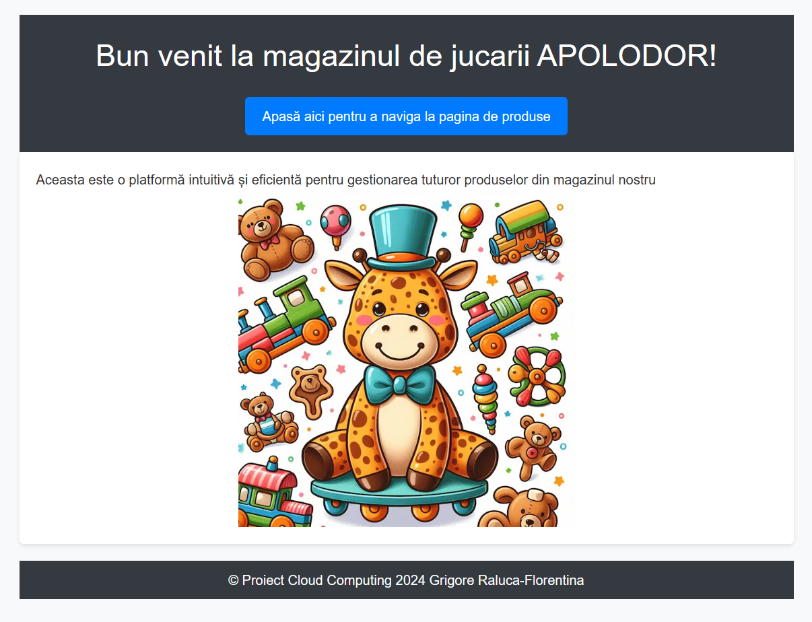
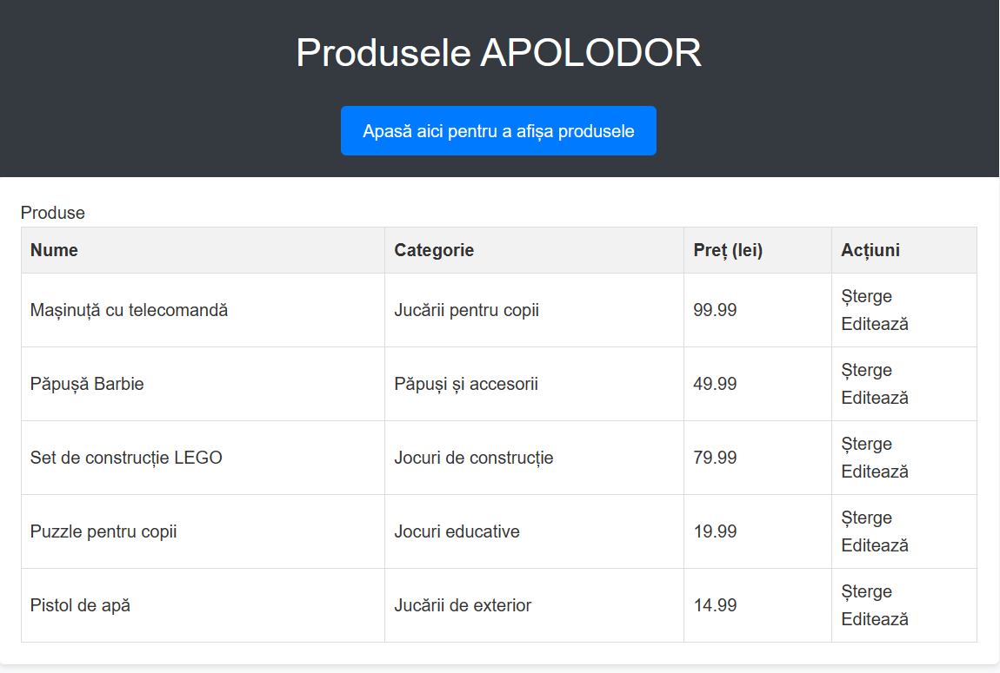
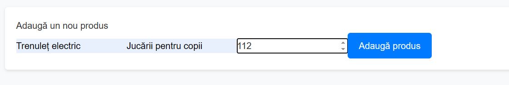

Titlu: Aplicație pentru gestiunea produselor dintr-un magazin de jucării
Nume: Grigore Raluca-Florentina
Grupa: 1132

Link video prezentare proiect: https://youtu.be/nLA97goOtgU 
Link publicare Vercel: https://simpre-cloud-com-git-017eab-grigore-raluca-florentinas-projects.vercel.app

1. Introducere
Această documentație descrie un proiect pentru gestionarea produselor într-un magazin de jucării. Proiectul include o aplicație web pentru gestionarea produselor, utilizând un API pentru a comunica cu baza de date și a efectua operațiile CRUD (Create, Read, Update, Delete).

2. Descriere problemă
Problema adresată de acest proiect este gestionarea eficientă a produselor într-un magazin de jucării. Prin intermediul aplicației web, administratorul magazinului poate vizualiza, adăuga, actualiza și șterge produse.

3. Descriere API
API-ul este o interfață pentru comunicarea între aplicație și baza de date. Acesta oferă endpoint-uri pentru a efectua operațiile CRUD asupra produselor. Endpoint-urile includ:

GET /api/produse: Returnează toate produsele disponibile.
POST /api/produse: Adaugă un nou produs.
PUT /api/produse/:id: Actualizează un produs existent.
DELETE /api/produse/:id: Șterge un produs existent.

4. Flux de date
Requeest GET:
GET /api/produse

Response GET:
{
    "data": [
        {
            "_id": "663a6b323992aebcaf6fce1b",
            "nume": "Mașinuță cu telecomandă",
            "categorie": "Jucării pentru copii",
            "preț": "99.99"
        },
        {
            "_id": "663a6b4d3992aebcaf6fce1d",
            "nume": "Păpușă Barbie",
            "categorie": "Păpuși și accesorii",
            "preț": 49.99
        },
        {
            "_id": "663a6b593992aebcaf6fce1f",
            "nume": "Set de construcție LEGO",
            "categorie": "Jocuri de construcție",
            "preț": 79.99
        },
        {
            "_id": "663a6b683992aebcaf6fce21",
            "nume": "Puzzle pentru copii",
            "categorie": "Jocuri educative",
            "preț": 19.99
        }
    ]
}

Request POST:
POST /api/produse
Content-Type: application/json
{
  "nume": "Tablă de desen magnetică",
  "categorie": "Jucării creative",
  "preț": 39.99
}

Response POST:
{
    "data": {
        "acknowledged": true,
        "insertedId": "663bbc9a53ee1fa6eda1b577"
    }
}

Request PUT:
PUT /api/produse?id=663bbc9a53ee1fa6eda1b577
Content-Type: application/json
{
   "_id":"663bbc9a53ee1fa6eda1b577",
   "nume": "Tablă de desen magnetică",
   "categorie": "Jucării creative",
   "preț": 69.99
}

Response PUT:
{
    "data": {
        "acknowledged": true,
        "modifiedCount": 1,
        "upsertedId": null,
        "upsertedCount": 0,
        "matchedCount": 1
    }
}

Request DELETE:
DELETE /api/produse?id=663a6b763992aebcaf6fce23

Response DELETE:
{
    "data": {
        "acknowledged": true,
        "deletedCount": 1
    }
}

5. Capturi de ecran aplicație

6. Referinte
https://lungu-mihai-adrian.gitbook.io/cloud-computing-2024-simpre
https://github.com/MihaiAdrianLungu/SIMPRE-2024